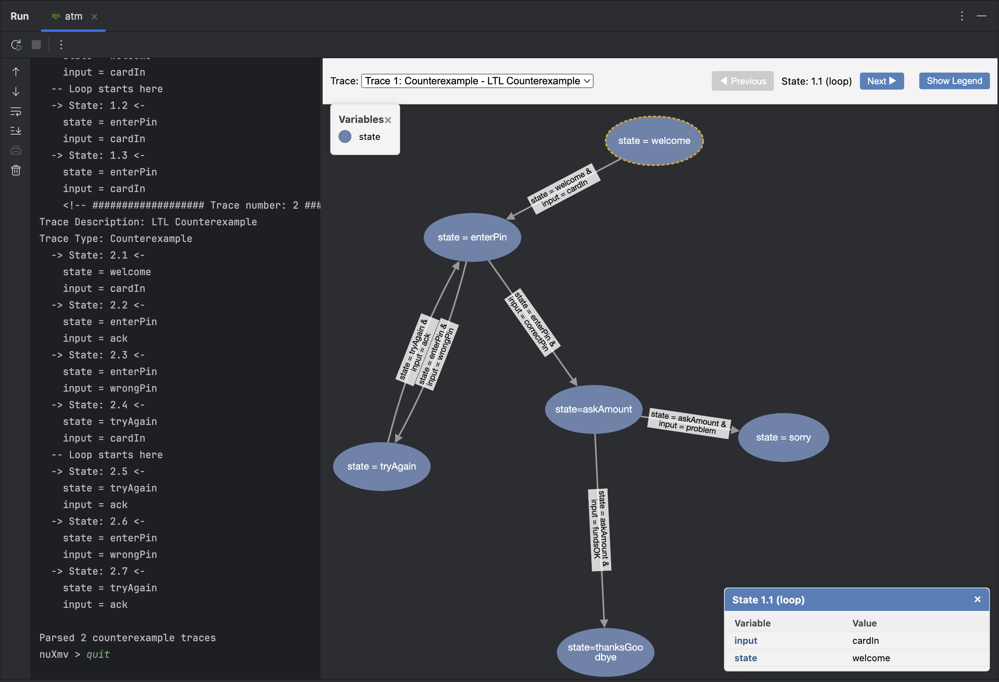

# NuXmv Plugin for IntelliJ IDEA

This plugin provides comprehensive language support and development tools for the [NuXmv](https://nuxmv.fbk.eu/) formal
verification tool within IntelliJ IDEA.
___

## Features

### Language Support

- Syntax highlighting for NuXmv model files (`.smv`, `.xmv`, `.nuxmv`)
- Code completion for keywords, operators, variables, and module names
- Error highlighting and annotations
- Structure view for navigating model elements
- Code folding and formatting
- Find usages and navigation
- Reference resolution for variables, modules, and definitions

### Run Configuration

- Built-in run configuration for NuXmv models
- Support for different verification engines (BDD, MSAT)
- Configurable verification options for CTL, LTL, and INVAR specifications
- Integrated console with output parsing

### Model Visualization

<br></br>

<br></br>

- Interactive visualization of state models and transitions
- Counterexample trace visualization with state details
- State variable tracking across traces
- Browser-based embedded visualization using JCEF

### FOR Loop Macro

```
-- FOR loop macro allows concise specification of repetitive model elements
#FOR i IN 1..3
  ASSIGN
    x[i] := i mod 2 = 0;
#END
ENDFOR
-- Expands to:
ASSIGN
    x[1] := 1 mod 2 = 0;
ASSIGN
    x[2] := 2 mod 2 = 0;
ASSIGN
    x[3] := 3 mod 2 = 0;
```

___

## Installation

### Prerequisites

- IntelliJ IDEA 2023.1 or higher
- NuXmv executable installed on your system

### Install from JetBrains Marketplace

Plugin is available on [JetBrains Marketplace](https://plugins.jetbrains.com/plugin/27383-nuxmv)

### Build from Source

1. Clone this repository
2. Build the plugin:
   ```bash
   ./gradlew build
   ```
3. Install the plugin from disk in IntelliJ IDEA:
    - Go to Settings → Plugins → ⚙️ → Install Plugin from Disk
    - Select the generated plugin file in `build/distributions/`

___

## Usage

### Setting up the Plugin

1. Configure the path to your NuXmv executable in Settings → Tools → NuXmv Settings
2. Open or create a NuXmv model file (`.smv`, `.xmv`, `.nuxmv`)

### Running Models

1. Open a NuXmv model file
2. Click on the green "Run" button or right-click and select "Run File with NuXmv"
3. Configure verification options in the run configuration dialog
4. View results in the integrated console

___

## Contributing

Please read [CONTRIBUTING.md](CONTRIBUTING.md) for details on the project's code of conduct and the process for
submitting pull
requests.
___

## License

[Apache-2.0](LICENSE)

---
*Note: This plugin is not affiliated with the official NuXmv project.*
